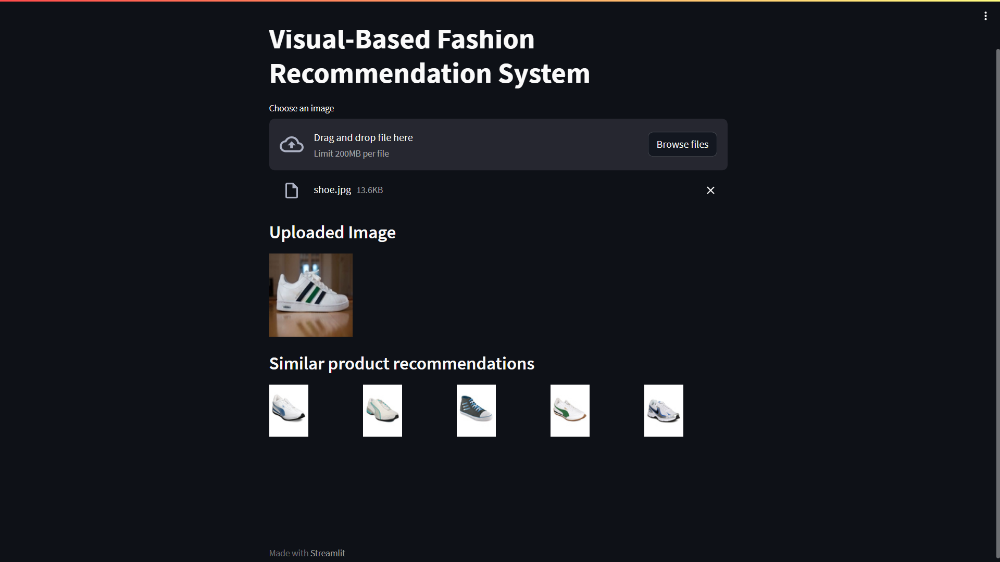
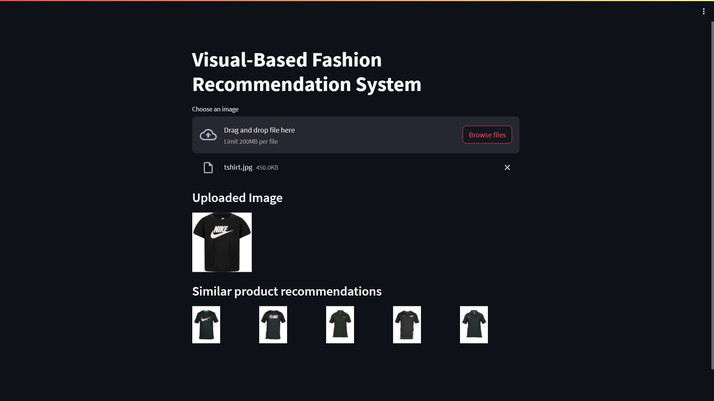

# Visual-Based E-Commerce Fashion Recommendation System
A Deep Learning-based Fashion Recommendation System utilizing the ResNet50 architecture. It provides fashion recommendations based on visual similarity.  
This project was completed as part of Samsung's Applied Data Science Course.

## Dataset

The dataset used for training and evaluation can be found at the following link: 
- [Fashion Product Images (Small)](https://www.kaggle.com/datasets/paramaggarwal/fashion-product-images-small)
- [Fashion Product Images (Large)](https://www.kaggle.com/datasets/paramaggarwal/fashion-product-images-dataset/data)


## Training the Model

To train the recommendation system, follow these steps:

1. Download the dataset from one of the provided links and place it in an `data` directory.
2. Run the `train.py` script. This will generate two important files: `embeddings.pkl` and `filenames.pkl`.

## Running the Streamlit App

The Streamlit app provides an interface to interact with the recommendation system. To run the app, follow these instructions:
```bash
streamlit run main.py
```
   
## Screenshots




